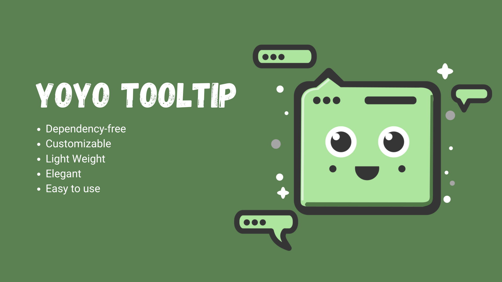
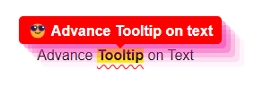

# Yoyo Tooltip



[View Demo](https://smallvi.github.io/projects/yoyoTooltip/)

## Introduction

This plugin provides a customizable tooltip without any dependencies.

## Screenshot



## Installation

- #### Install Package

```bash
# npm
npm install yoyo-tooltip

# yarn
yarn add yoyo-tooltip
```

```javascript
import { yoyoTooltip } from './node_modules/yoyo-tooltip/dist/yoyoTooltip.min.mjs';
```


- #### CDN

```html
<!-- jsDelivr CDN -->
<script src="https://cdn.jsdelivr.net/gh/smallvi/yoyoTooltip@latest/dist/yoyoTooltip.umd.min.js"></script>

<!-- unpkg CDN -->
<script src="https://unpkg.com/yoyo-toast@latest/dist/yoyoTooltip.umd.min.js"></script>
```

- #### Self Hosted

```html
<script src="path/to/yoyoTooltip.umd.min.js"></script>
```

- #### Self Hosted (ES6 Module)

```javascript
import { yoyoTooltip } from 'path/to/yoyoTooltip.mjs';
```

## Usage
    
### Simple Yoyo Tooltip

```javascript
yoyoTooltip({
    id: '#text',
    content: '😂 Simple Tooltip on text',
});
```
    
### Advance Yoyo Tooltip

```javascript
yoyoTooltip({
    id: '#text',
    content: '😎 <strong>Advance Tooltip</strong> on text',
    direction: 'top',
    delay: '0',
    trigger: 'hover',
    backgroundColor: '#ff0000',
    color: '#ffffff',
    boxShadow: 'rgba(240, 46, 170, 0.4) 5px 5px, rgba(240, 46, 170, 0.3) 10px 10px, rgba(240, 46, 170, 0.2) 15px 15px, rgba(240, 46, 170, 0.1) 20px 20px, rgba(240, 46, 170, 0.05) 25px 25px',
    targetHighlight: true,
    targetTextDecoration: 'underline wavy red 1px',
    targetUnderlineOffset: '10px',
    targetBackgroundColor: 'yellow',
    targetFontWeight: 'bold',
});
```

## Param
- id: target element id
- content: Main Text
- direction: Optional, {'top', 'right', 'left', 'bottom'} (Default Top)
- delay: Optional, (Default 0) (1000 = 1 sec)
- trigger: Optional, {'hover','click'} (Default Hover)
- backgroundColor: Optional (Default black)
- color: Optional (Default white)
- boxShadow: Optional
- targetHighlight: Optional, {true, false} (Default true)
- targetTextDecoration: Optional
- targetUnderlineOffset: Optional
- targetBackgroundColor: Optional
- targetFontWeight: Optional

## License

This project is licensed under the MIT License - see the [LICENSE](LICENSE) file for details.